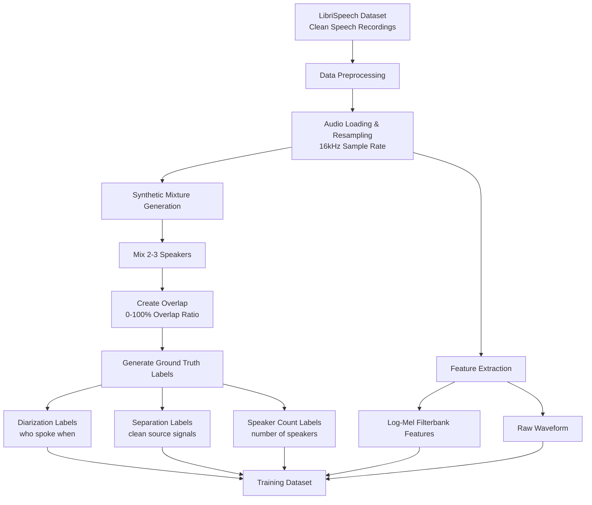
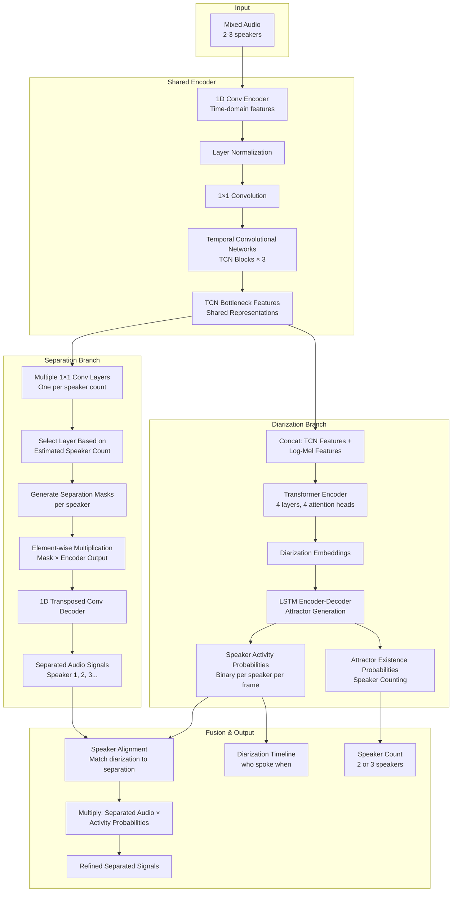
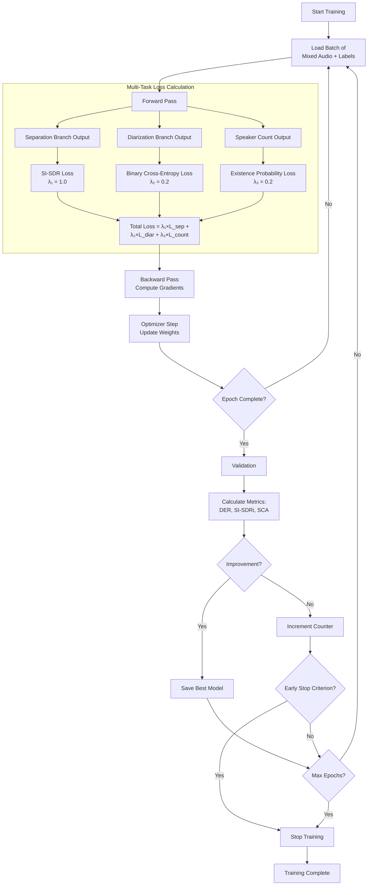
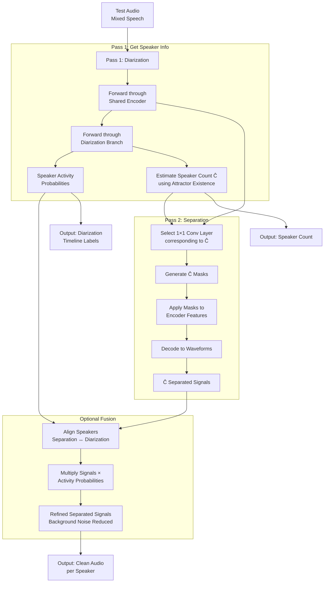
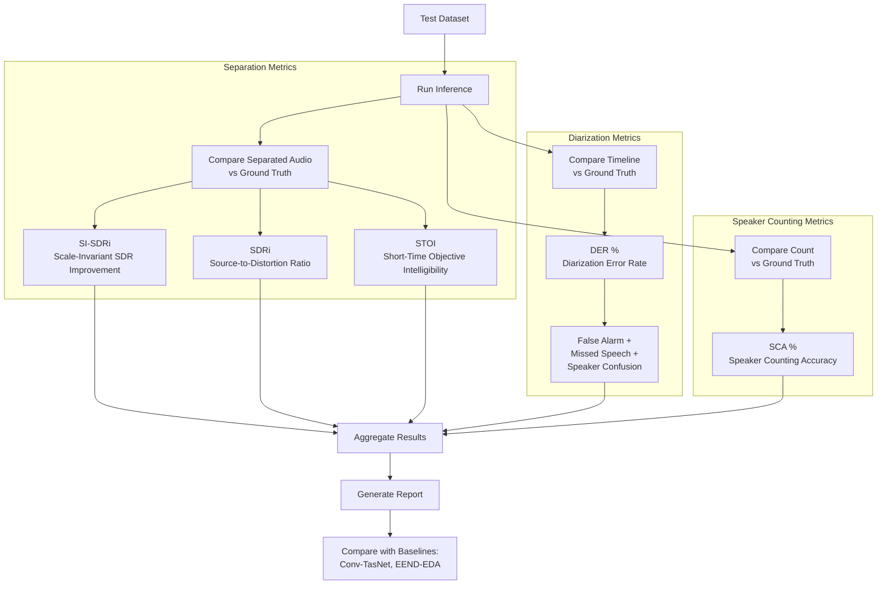
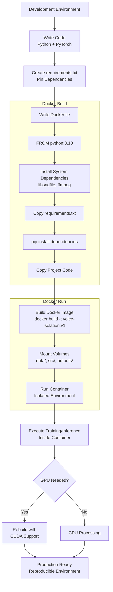

# Voice Isolation System - Project Workflow

## Project Overview
A multi-task deep learning system for speaker diarization, speech separation, and speaker counting using joint end-to-end neural networks (EEND-SS architecture).

---

## 1. Data Pipeline Workflow



---

## 2. Model Architecture Workflow



---

## 3. Training Workflow



---

## 4. Inference (2-Pass) Workflow



---

## 5. Evaluation Workflow



---

## 6. Docker Deployment Workflow



---

## 7. Project Directory Structure

```
voice-isolation-project/
│
├── data/
│   ├── raw/                    # LibriSpeech clean recordings
│   │   └── dev-clean/
│   │       └── [speaker-id]/
│   │           └── [chapter-id]/
│   │               └── *.flac
│   ├── processed/              # Preprocessed features
│   │   ├── features/           # Log-mel spectrograms
│   │   └── mixtures/           # Synthetic mixed audio
│   └── splits/                 # Train/val/test splits
│
├── src/
│   ├── preprocessing/
│   │   ├── audio_utils.py      # Load, resample, plot audio
│   │   ├── feature_extraction.py  # Mel-spectrograms, STFT
│   │   └── mixture_generator.py   # Create 2-3 speaker mixes
│   │
│   ├── models/
│   │   ├── conv_tasnet.py      # Separation encoder-decoder
│   │   ├── eend.py             # Diarization transformer
│   │   ├── eda.py              # Speaker counting module
│   │   └── eend_ss.py          # Joint model (main)
│   │
│   ├── training/
│   │   ├── train.py            # Training loop
│   │   ├── losses.py           # SI-SDR, BCE, PIT loss
│   │   └── optimizer.py        # Adam optimizer setup
│   │
│   └── evaluation/
│       ├── metrics.py          # DER, SI-SDRi, SCA
│       └── inference.py        # 2-pass inference
│
├── test_code/                  # Unit tests and experiments
├── outputs/                    # Saved models, logs, results
├── notebooks/                  # Jupyter notebooks for analysis
│
├── Dockerfile                  # Container specification
├── requirements.txt            # Python dependencies
├── .dockerignore              # Exclude from Docker build
└── README.md                  # Project documentation
```

---

## 8. Key Technical Components

### **Preprocessing**
- **Input:** LibriSpeech .flac files (clean speech)
- **Process:** Resample to 16kHz, extract mel-spectrograms
- **Output:** Mixed audio (2-3 speakers) + ground truth labels

### **Shared Encoder (Conv-TasNet Style)**
- 1D convolution: Raw waveform → learned features
- Temporal Convolutional Networks (TCNs): Capture temporal patterns
- Output: Bottleneck features (shared between tasks)

### **Separation Branch**
- Multiple 1×1 conv layers (one per speaker count)
- Dynamically select layer based on estimated count
- Generate masks → apply to encoder features → decode to audio

### **Diarization Branch**
- Transformer encoder: Capture long-range context
- LSTM encoder-decoder attractors: Speaker representations
- Output: Per-frame speaker activity (binary labels)

### **Speaker Counting**
- Attractor existence probabilities
- Threshold to determine number of active speakers

### **Multi-Task Training**
- Joint loss: Separation + Diarization + Counting
- Backpropagation updates all branches simultaneously
- Shared encoder learns representations useful for all tasks

### **Fusion Technique**
- Align diarization output with separated audio
- Multiply separated signals by activity probabilities
- Reduces background noise when speaker is silent

---

## 9. Simplified Prototype Approach

For this learning project, we simplify:

1. **Smaller model:** Fewer TCN layers, smaller transformer
2. **Limited speakers:** Only 2-3 speakers (not 5+)
3. **Synthetic data:** Mix clean recordings (not real overlapped audio)
4. **Basic counting:** Use diarization outputs (not full EDA module)
5. **CPU training:** Start without GPU optimization

**Goal:** Understand core concepts, not state-of-the-art performance

---

## 10. Timeline Estimate

| Phase | Tasks | Duration |
|-------|-------|----------|
| **Phase 1** | Audio preprocessing, feature extraction | Week 1-2 |
| **Phase 2** | Conv-TasNet separation model | Week 3-4 |
| **Phase 3** | EEND diarization model | Week 5-6 |
| **Phase 4** | Joint training (EEND-SS) | Week 7-8 |
| **Phase 5** | Evaluation, Docker setup, documentation | Week 9-10 |

**Total:** ~10 weeks at 5-6 hours/week

---

## References

- **Paper:** EEND-SS (Maiti et al., 2022) - arXiv:2203.17068
- **Dataset:** LibriSpeech - http://www.openslr.org/12
- **Framework:** PyTorch for deep learning
- **Deployment:** Docker for reproducibility

---

*This workflow provides a comprehensive overview of the voice isolation system, from data preparation through model deployment and evaluation.*