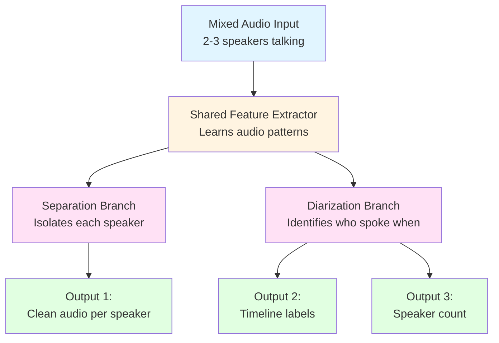

# Voice Isolation System

## Project Goal
Build an AI system that can:
1. **Separate** multiple speakers talking at the same time
2. **Identify** who spoke when (timeline)
3. **Count** how many speakers are present (2 or 3)
4. **transcript** give a text transcript of who spoke what

---

## High-Level Workflow (5 Steps)


### Step 1: **Input Data** 
- Start with clean speech recordings (LibriSpeech dataset)
- Each speaker recorded separately, reading book chapters

### Step 2: **Create Mixed Audio** 
- Artificially mix 2-3 speakers together
- Add overlapping speech (people talking at same time)
- Create ground truth labels (correct answers for training)

### Step 3: **AI Model Processing** 
- Feed mixed audio into neural network
- Model has 3 branches working together
- Learns patterns from training data

### Step 4: **Three Outputs** 
- **Separated Audio**: Clean voice for each speaker
- **Timeline**: Who spoke when (diarization)
- **Count**: How many speakers detected

### Step 5: **Evaluation** 
- Compare outputs with ground truth
- Calculate accuracy metrics
- Improve model based on results

---

## The AI Model (Simplified Architecture)



### How It Works:
1. **Shared Layer**: Learns features useful for both tasks
2. **Two Specialized Branches**: 
   - One focuses on separating voices
   - One focuses on identifying speakers
3. **Joint Training**: Both branches learn together, helping each other improve

---
## Key Innovation (Why This is Better)

### Traditional Approach:
```
Mixed Audio → Separate first → Then identify speakers
                 OR
Mixed Audio → Identify first → Then separate
```
❌ Must choose order  
❌ Errors propagate  
❌ Two separate systems  

### Our Approach (EEND-SS):
```
Mixed Audio → [Joint Model] → Separation + Diarization + Counting
                              (All at once)
```
✅ No need to choose order  
✅ Tasks help each other  
✅ One unified system  

---

## Technologies Used

| Component | Technology | Purpose |
|-----------|-----------|---------|
| Programming | Python 3.10 | Main language |
| Deep Learning | PyTorch | Build neural networks |
| Audio Processing | Librosa | Handle audio files |
| Dataset | LibriSpeech | Clean speech recordings |
| Deployment | Docker | Reproducible environment |

---


## Metrics We Measure:
1. **Separation Quality**: How clear is each speaker's voice?
2. **Diarization Accuracy**: How correctly did we identify "who spoke when"?
3. **Counting Accuracy**: Did we count speakers correctly?

---

## Project Structure (Simplified)

```
project/
├── data/              ← Audio files
├── src/               ← Our code
│   ├── preprocessing/ ← Prepare data
│   ├── models/        ← AI models
│   └── training/      ← Train models
├── outputs/           ← Results
└── Dockerfile         ← Environment setup
```


---

## Why This Matters

**Real-world applications:**
- Meeting transcription (who said what?)
- Podcast editing (separate speakers)
- Multi-party conversation analysis
- Broadcast media processing